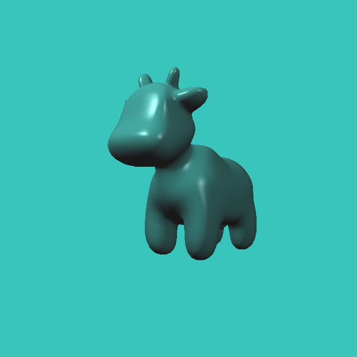
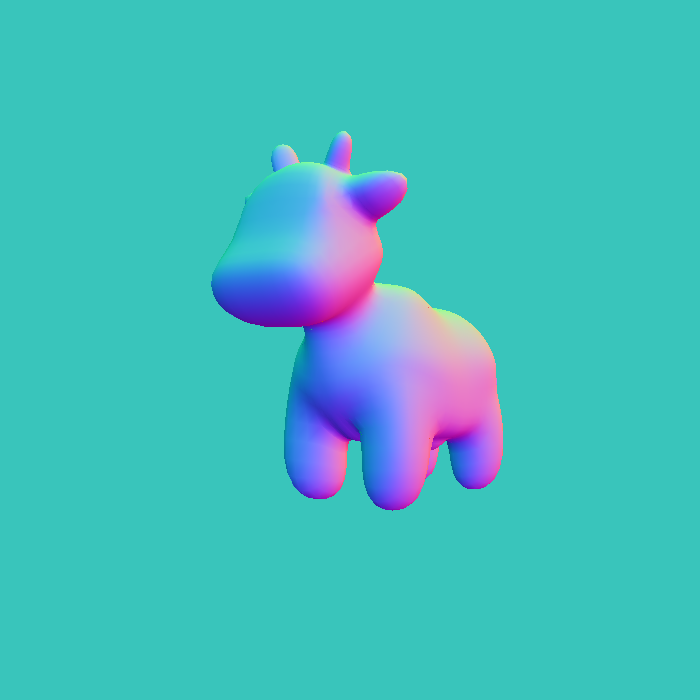
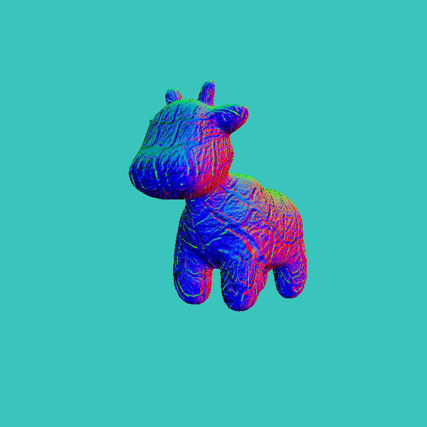
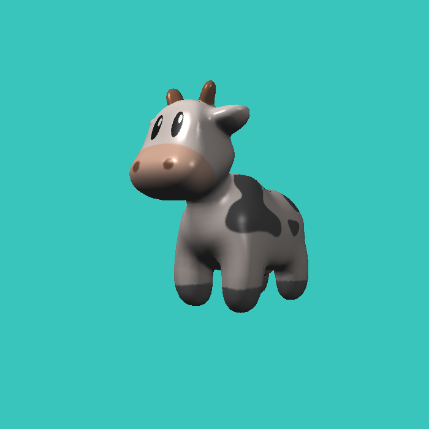

# Mister Renderer v1.1

这是一个依照GAMES101程序制作的渲染器（没错，连cmake文件都一模一样），你应该会看见这个commit。没错，这个是为我生日创作的一份礼物（我是尊贵的8/31生日用户）。

---

## v1.1 更新
- 修复一些已知bug
  - 纹理不能正常加载
  - 统一颜色至0 ~ 1区间
  - 缩减体积
- 新增<code>output</code>文件夹以示效果 

---

<code>Blinn-Phong</code> 着色器:

<code>Normal</code> 着色器:

<code>Displacement</code> 着色器:

<code>Bump</code> 着色器:

<code>Texture</code> 着色器:

---

**轻点喷！！！**

develop by 5xian_39